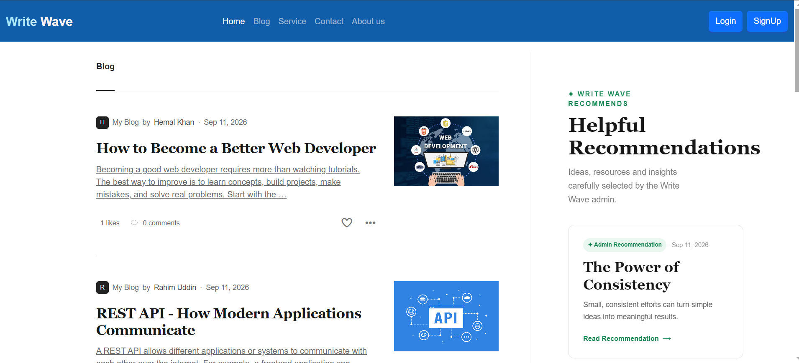
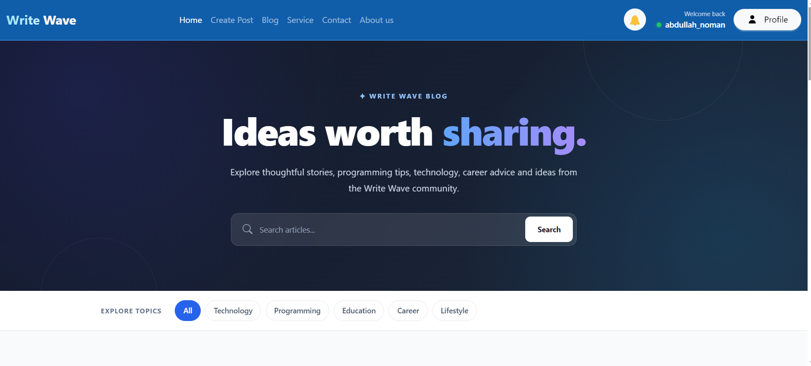
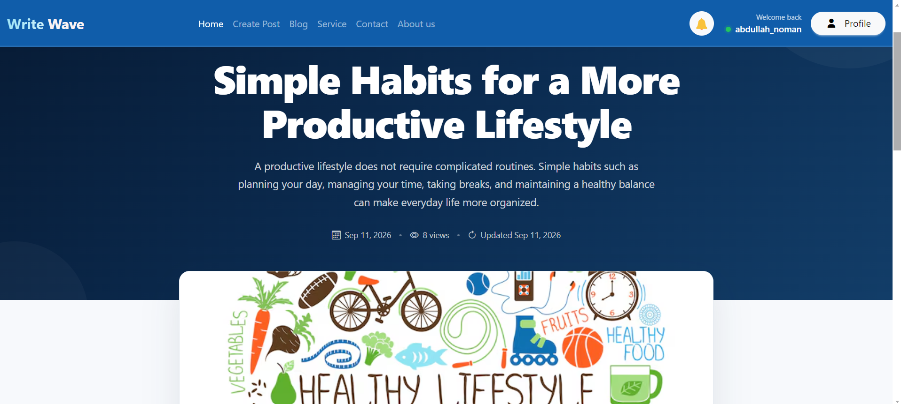
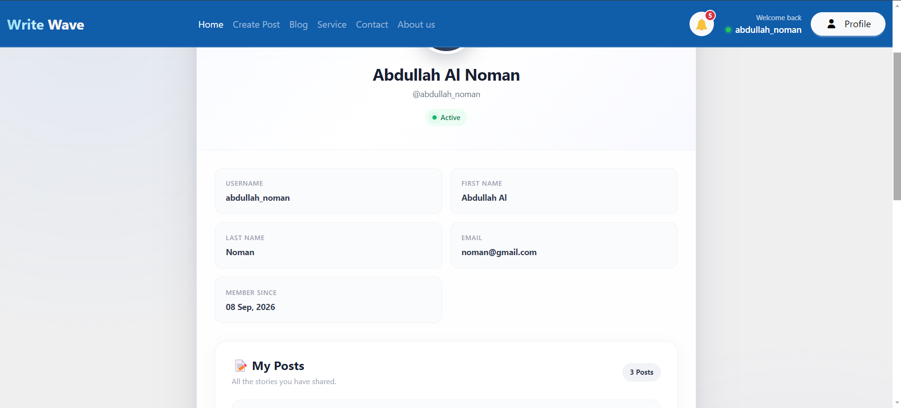

# ✍️ Write Wave — Modern Django Blogging Platform

<p align="center">
  <strong>A modern, responsive and feature-rich blogging platform built with Django.</strong>
</p>

<p align="center">
  <a href="https://blog-project-write-wave.onrender.com">🌐 Live Demo</a>
  •
  <a href="https://github.com/AbdullahNoman-01/blog-project-write-wave-">💻 GitHub Repository</a>
</p>

---

## 📌 About The Project

**Write Wave** is a modern blogging platform developed with **Python and Django**.

The main goal of this project is to create a complete blogging experience where users can explore articles, create posts, interact with content, receive notifications, and discover recommended content through a clean and responsive interface.

The project focuses on combining **Django backend development**, **database management**, **dynamic templates**, **user interaction**, and **modern frontend design** into one complete web application.

---

## 🌐 Live Demo

🚀 **Live Website:**
https://blog-project-write-wave.onrender.com

💻 **GitHub Repository:**
https://github.com/AbdullahNoman-01/blog-project-write-wave-

---

## ✨ Key Features

### 🏠 Home Page

* Modern landing page
* Clean and responsive UI
* Featured content
* Navigation to major sections
* Responsive design for different screen sizes

### 📝 Blog System

* Browse blog articles
* Read individual articles
* Create blog posts
* Edit posts
* Delete posts
* Dynamic blog content
* Article detail pages
* Search functionality
* Blog filtering

### 🏷️ Categories & Tags

* Dynamic tags
* Tag-based filtering
* Discover articles by topics
* Organized content browsing

### ❤️ User Interaction

* Like posts
* Comment on posts
* User engagement system
* Notifications for interactions

### 🔔 Notification System

* Notification support
* User interaction notifications
* Dynamic notification display

### 👤 User Profile

* User profile section
* Profile-related information
* User-specific interaction area

### ⭐ Recommendations

* Admin recommendations
* Recommended articles/content
* Dedicated recommendation section
* Recommendation detail pages

### 📞 Contact

* Dedicated Contact page
* Contact form
* User-friendly contact interface

### ℹ️ About Us

* Project information
* Platform introduction
* Purpose and vision of Write Wave

### 🛠️ Services

* Dedicated services section
* Platform capabilities
* Clean service presentation

### 🔐 Authentication

* User authentication system
* Login
* Registration
* Logout
* User-based functionality

---

## 🧰 Technology Stack

| Technology            | Purpose                     |
| --------------------- | --------------------------- |
| 🐍 Python             | Backend programming         |
| 🌐 Django             | Web framework               |
| 🗄️ SQLite / Database | Data management             |
| 🎨 HTML5              | Page structure              |
| 🎨 CSS3               | Styling & responsive design |
| ⚡ JavaScript          | Client-side interactions    |
| 🅱️ Bootstrap         | Responsive UI components    |
| ☁️ Render             | Deployment & hosting        |
| 🔧 Git                | Version control             |
| 🐙 GitHub             | Source code hosting         |

---

## 🏗️ Project Architecture

The project follows Django's modular application architecture.

```text
blog-project-write-wave/
│
├── manage.py
│
├── project/
│   ├── settings.py
│   ├── urls.py
│   ├── asgi.py
│   └── wsgi.py
│
├── blogs/
│   ├── models.py
│   ├── views.py
│   ├── urls.py
│   ├── forms.py
│   └── templates/
│
├── posts/
│   ├── models.py
│   ├── views.py
│   ├── urls.py
│   ├── forms.py
│   └── templates/
│
├── contact/
│   ├── models.py
│   ├── views.py
│   ├── forms.py
│   └── templates/
│
├── recommendations/
│   ├── models.py
│   ├── views.py
│   ├── urls.py
│   └── templates/
│
├── templates/
│   └── base.html
│
├── static/
│   ├── css/
│   ├── js/
│   └── images/
│
├── media/
│
├── requirements.txt
├── .gitignore
└── README.md
```

> **Note:** Folder names may vary depending on the final project structure.

---

# 🚀 Getting Started

Follow the steps below to run **Write Wave** locally.

## 1️⃣ Clone the Repository

```bash
git clone https://github.com/AbdullahNoman-01/blog-project-write-wave-.git
```

Move into the project directory:

```bash
cd blog-project-write-wave-
```

---

## 2️⃣ Create a Virtual Environment

### Windows

```bash
python -m venv venv
```

Activate it:

```bash
venv\Scripts\activate
```

### macOS / Linux

```bash
python3 -m venv venv
```

```bash
source venv/bin/activate
```

---

## 3️⃣ Install Dependencies

```bash
pip install -r requirements.txt
```

---

## 4️⃣ Apply Migrations

```bash
python manage.py makemigrations
```

```bash
python manage.py migrate
```

---

## 5️⃣ Create a Superuser

To access the Django admin panel:

```bash
python manage.py createsuperuser
```

Follow the instructions shown in the terminal.

---

## 6️⃣ Run the Development Server

```bash
python manage.py runserver
```

Then open:

```text
http://127.0.0.1:8000/
```

---

# 🔐 Environment Variables

For production, sensitive configuration should be stored using environment variables rather than hard-coding secrets.

Example:

```env
SECRET_KEY=your-secret-key
DEBUG=False
ALLOWED_HOSTS=your-domain.com
```

For local development, you can use a `.env` file if your project is configured to load environment variables.

> Never commit real secret keys, passwords, API keys, or other sensitive credentials to GitHub.

---

# 🖥️ Admin Panel

Django provides an administration interface for managing application data.

After creating a superuser, visit:

```text
http://127.0.0.1:8000/admin/
```

From the admin panel, authorized administrators can manage relevant project content such as posts, recommendations, users, and other registered models.

---

# ☁️ Deployment

The project is deployed using **Render**.

### Production Website

```text
https://blog-project-write-wave.onrender.com
```

The application is configured for deployment using Django's production settings and a production WSGI server.

For production deployment, make sure to configure:

* `DEBUG=False`
* `ALLOWED_HOSTS`
* `CSRF_TRUSTED_ORIGINS`
* Environment variables
* Static files
* Database configuration
* Production server configuration

---

# 🔒 Security

The project uses Django's built-in security features, including:

* CSRF protection
* Django authentication
* Password hashing
* Session management
* Secure form handling
* Environment-based configuration

Production deployments should keep secret values outside the source code and configure trusted origins correctly.

---

# 📱 Responsive Design

Write Wave is designed to provide a smooth experience across:

* 💻 Desktop
* 💻 Laptop
* 📱 Mobile
* 📟 Tablet

The interface uses responsive layouts and modern UI components to maintain usability across different screen sizes.

---

# 🎯 Project Goals

The main goals of **Write Wave** are:

* Learn and practice advanced Django development
* Build a real-world blogging platform
* Implement CRUD functionality
* Work with Django models and relationships
* Practice authentication and authorization
* Implement user interactions
* Build dynamic pages using Django templates
* Create responsive frontend interfaces
* Deploy a Django application to the cloud
* Understand production deployment concepts

---

# 🚧 Future Improvements

Some possible future improvements include:

* 🤖 AI-powered article search
* 🔎 Advanced search with multiple filters
* 💬 Improved comment system
* ❤️ Advanced recommendation algorithm
* 📊 User analytics dashboard
* 📧 Email notifications
* 🔔 Real-time notifications
* 🌙 Dark mode
* 🖼️ Better media management
* 🔐 More advanced permission management
* 🚀 Performance optimization
* 📱 Progressive Web App support

---

# 🧪 Development

During development, the project can be tested locally using:

```bash
python manage.py runserver
```

Django's development workflow makes it straightforward to work with models, views, templates, URL routing, forms, migrations, and the admin interface.

---

# 📸 Screenshots

You can add screenshots of the project here.

Example:

```md
## 📸 Screenshots

### Home Page



### Blog Page



### Article Detail



### Profile


```

Recommended screenshot folder:

```text
screenshots/
├── home.png
├── blog.png
├── blog-detail.png
├── create-post.png
├── profile.png
└── recommendations.png
```

---

# 🤝 Contributing

Contributions, suggestions, and improvements are welcome.

### Steps

1. Fork the repository
2. Create a new branch

```bash
git checkout -b feature/new-feature
```

3. Make your changes
4. Commit your changes

```bash
git commit -m "Add new feature"
```

5. Push the branch

```bash
git push origin feature/new-feature
```

6. Open a Pull Request

---

# 👨‍💻 Developer

### Abdullah Al Noman

Python & Django Developer

Interested in:

* Python
* Django
* Web Development
* Backend Development
* Database Systems
* REST APIs
* Software Engineering

---

## 🔗 Connect & Explore

🌐 **Live Project:**
https://blog-project-write-wave.onrender.com

🐙 **GitHub:**
https://github.com/AbdullahNoman-01

📂 **Project Repository:**
https://github.com/AbdullahNoman-01/blog-project-write-wave-

---

# ⭐ Support

If you like this project, consider giving the repository a ⭐ on GitHub.

Your support and feedback are always appreciated!

---

<p align="center">
  Built with ❤️ using Python & Django
</p>
